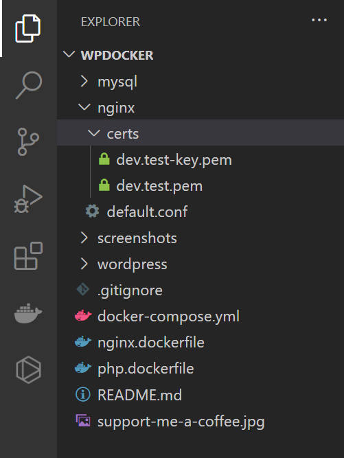
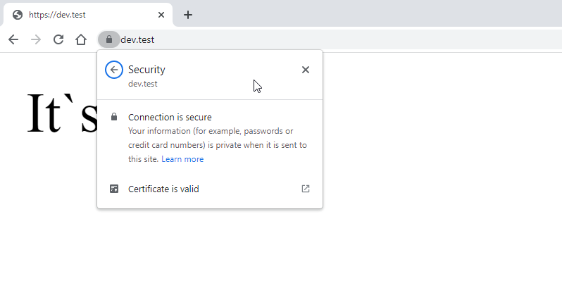

# Docker for WordPress and more

A simple setup Web Development with Docker :hearts: WordPress or any PHP application

Support on 
 - :white_check_mark: Mac Intel, Mac M1 Chip
 - :white_check_mark: Windows 10 / 11 with WSL2 
 - :white_check_mark: Linux
  

Follow the update and get an question to me on WordPress Group [https://www.facebook.com/groups/wordpressviet/posts/5154112297936613]

### Feature Updated 2022

- Add https on local dev
- Add custom domain like https://dev.test, ...

### Required
- Docker 
- WP-CLI ( https://wp-cli.org ) 
- WSL2 on Windows ( optional )
- Setup `mkcert` at https://github.com/FiloSottile/mkcert
- TablePlus, MySQL Workbench or any a client connect to MySQL

### Install

- `cd wpdocker` and `cd nginx` and `mkdir certs`
- Run `mkcert dev.test` and you have 2 files .pem
- Run `docker-compose up -d --build`
- Run `sudo chmod -R 777 wordpress/` ( optional )
- Put your content into `wordpress` folder
- Open on browser https://dev.test 
- Warning: add `platform: linux/x86_64` when use MACOS M1 devices

### MySQL
- Hostname: `localhost` | `3060`
- Usename: `wp` | password: `secret`
- Mysql hostname: `mysql`
- Database name: wp
- Use client MySQL to connect like TablePlus, MySQL Workbench ...

### Screenshots

