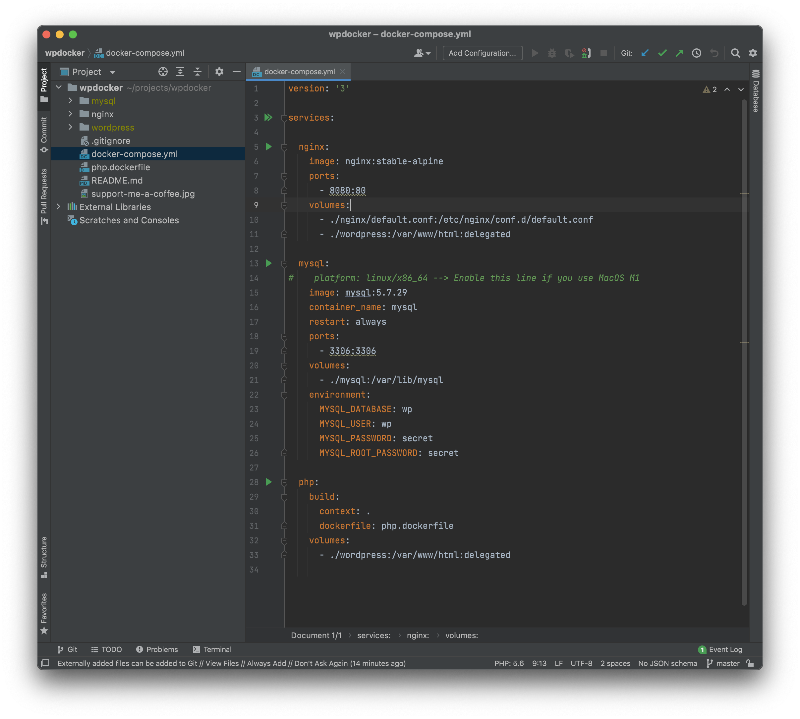

# WPDocker

A simple setup Web Development with Docker :hearts: WordPress or any PHP application

Support on 
 - :white_check_mark: Mac Intel, Mac M1 Chip
 - :white_check_mark: Windows 10 / 11 with WSL2 
 - :white_check_mark: Linux
  

Follow the update and get an question to me on WordPress Group [https://www.facebook.com/groups/wordpressviet/posts/5154112297936613]

### :fire: What's next 2022 ( coming soon )
- :information_source: Document setup details on MacOS and Windows WSL2
- :information_source: Add multiple custom domain ( example: domain1.test, domain2.test ) ONLY a source code.
- :information_source: Add https on localhost ( example: https://domain1.test, https://domain2.test )

### Required
- Docker 
- WP-CLI ( https://wp-cli.org ) 
- WSL2 on Windows ( optional )
- TablePlus, MySQL Workbench or any a client connect to MySQL

### Install
- Run `docker-compose up -d` on root project.
- Go to `cd wordpress/` and `wp core download` to install WordPress lasted version. 
- Open `http://localhost:8080` see it working!

### MySQL
- hostname: `localhost` | `3060`
- usename: `wp` | password: `secret`
- mysql hostname: `mysql`
- Use client MySQL to connect like TablePlus, MySQL Workbench ...

### Added 
- :white_check_mark: Works on WSL2 for Windows 10/11 ( https://docs.microsoft.com/en-us/windows/wsl/install )
- :warning: Added Support Apple Silicon M1 ( please remove `platform: linux/x86_64` when use Intel chip )

### Bugs
- permission `chmod -R 777 wordpress/` if `wordpress/` folder not working

### Screenshots

### :+1: Work with me

Create a new Pull Request [https://github.com/thangnqs/wpdocker/pulls]

##### Buy me a Coffee :kissing_heart: :kissing_heart: :kissing_heart:

### And If you see it's works please press STAR :star: for me! Thanks 
